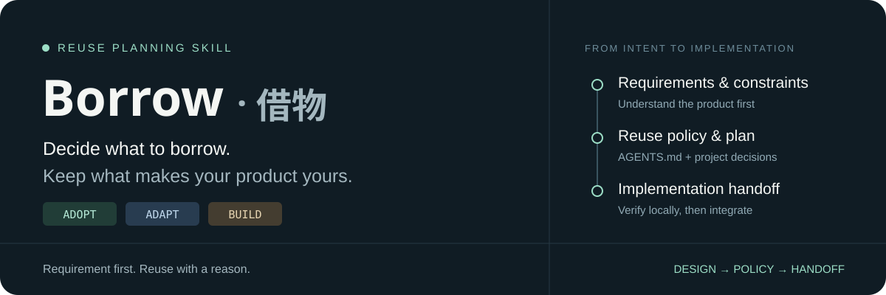

<h1 align="center">借物 · Borrow</h1>

<p align="center"><strong>Plan what to adopt, adapt, or build before coding.</strong><br>先理解需求，再决定哪些能力值得借、哪些逻辑由自己掌控。</p>

<p align="center">
  <a href="https://github.com/lagebattoo/borrow-skill/releases/tag/v0.1.1"></a>
  <a href="LICENSE"></a>
  <a href="tests/evals/README.md"></a>
</p>

<p align="center">
  <a href="#install-in-codex">Install 安装</a> ·
  <a href="#use">Use 使用</a> ·
  <a href="borrow/references/handoff-example.md">Example 示例</a> ·
  <a href="tests/evals/README.md">Evidence 验证</a>
</p>

Borrow is a design-stage reuse planning skill for AI coding agents. It turns
requirements into capability-level reuse decisions and carries lasting policies
into the target project's `AGENTS.md`.

> **复用的目标，是降低长期工程负担。** 先检查已有能力，再比较集成、测试、升级与维护成本；
> 核心业务规则始终由项目掌控。当前为早期版本：已有公开的离线验证证据，尚未验证真实项目与实时外部选型。

## What it does

| Understand | Decide | Hand off |
| --- | --- | --- |
| Requirements, constraints, existing capabilities and your reuse budget | ADOPT / ADAPT / BUILD, with ownership costs and product boundaries | Durable policy in `AGENTS.md`, current decisions in the plan, concrete checks for the implementing agent |

Borrow considers dependencies and services, reusable code and projects, and
knowledge or patterns. It separates commodity and supporting capabilities from
the logic that makes your product different.

At comparable ownership costs, Borrow prefers **ADOPT → ADAPT → BUILD**. A small
stable function can still be BUILD when a dependency would cost more to maintain.
Core product logic stays project-controlled while underlying infrastructure can
be reused.

Borrow handles planning. It does not install dependencies, implement the product,
automatically clone/fork candidates, or replace implementation-stage search-first.
When search-first is unavailable, the implementing agent receives the verification
requirements directly.

## Install in Codex

Ask Codex to use its built-in installer:

```text
Use $skill-installer to install the skill from
https://github.com/lagebattoo/borrow-skill/tree/v0.1.1/borrow
```

Alternatively, download the tagged repository and copy the complete `borrow/`
directory into your target project's `.agents/skills/borrow/`, retaining its
references, templates, metadata, and license. If that directory already exists,
review the existing installation before replacing it.

Only `borrow/` is the installable skill. The repository-root `AGENTS.md`, design
specifications, and `tests/` support development of this skill; they are not target
project instructions. Borrow itself has no executable scripts or runtime packages.
External discovery uses whatever research tools the host agent has available.

Local skill locations and discovery are described in the
[official Codex skill documentation](https://learn.chatgpt.com/docs/build-skills).
If the new skill is not visible in your session, restart Codex and try again.

## Use

```text
Use $borrow to plan a PDF analysis MVP for this repository.
Keep the current stack. Reuse budget: Balanced.
Identify reusable capabilities and the logic we should own.
Give me the plan first; do not edit files yet.
```

中文也可以直接调用：

```text
用 $borrow 规划这个功能，复用预算 Balanced。
先检查项目已有能力，说明哪些 ADOPT、ADAPT、BUILD，以及为什么。
这次先给方案，不修改文件。
```

Borrow can also be selected implicitly for meaningful project, feature,
architecture, migration, or major-refactor planning with plausible reuse
opportunities. Routine bug fixes, CSS edits, code explanations, and implementation
of settled plans should not start the full workflow automatically. Explicit small
requests receive a proportionate analysis.

## Reuse budget

| Level | Preference |
| --- | --- |
| Conservative | Existing capabilities and lightweight dependencies; new complexity needs a clear benefit. |
| Balanced | Default: balance delivery speed with long-term ownership. |
| Aggressive | Favor mature building blocks to shorten delivery. |
| Maximum Reuse | Assemble from existing capabilities wherever worthwhile; requires an active user choice. |

The budget changes tolerance for external complexity. It never relaxes requirement
fit, correctness, security, licensing, or platform constraints. Temporary feature
budgets do not silently replace a project's lasting policy.

## Outputs

For a CSV export, the plan might look like this:

| Capability | Decision | Project-owned boundary |
| --- | --- | --- |
| CSV encoding | **ADOPT** an existing suitable encoder | Verify its API and actual integration |
| Export composition | **ADAPT** through a thin adapter | Own the output contract and calling interface |
| Field selection and redaction | **BUILD** small product logic | Keep sensitive-data rules under project control |

This is a synthetic illustration, not a package recommendation. Follow the
[complete handoff example](borrow/references/handoff-example.md) from planning
to a fresh implementation session, with or without search-first.

Expect a capability reuse map, decision reasons, architecture/ownership boundaries,
and implementation handoff. POLICY, DECISION, PREFERENCE, and OPEN distinguish
durable rules, settled choices, recommendations, and unresolved questions.

Small decisions stay in the existing plan. Complex projects may use `REUSE_PLAN.md`.
Durable rules go into the target project's `AGENTS.md` when edits are authorized;
read-only requests receive proposed text. Missing evidence remains explicitly
unverified instead of becoming a passed check.

## Working with search-first

Borrow carries the design into **policy + plan**. The implementing agent reads
those artifacts, verifies current local capabilities and candidate evidence, and
then integrates. It can use search-first when available or perform the same checks
directly. Another Skill is optional; mentioning it does not invoke it.

A [pinned ECC search-first sample](tests/evals/COMPATIBILITY.md) demonstrated
explicit handoff and replacement of a stale preference. Automatic search-first
activation was not observed in the small implementation case. This is limited
compatibility evidence, not a promise of automatic chaining or full ECC support.

## Validation and limitations

All recorded model evaluations used Codex CLI `0.155.0-alpha.9.2` with
`gpt-6-astra` / `high`, using synthetic offline projects.

| Evidence set | Observed result | Scope |
| --- | --- | --- |
| [Initial baseline](tests/evals/REPORT.md) | 8 scenarios / 9 calls met their rubrics | Triggering, reuse decisions, budgets, filters and policy persistence; historical baseline |
| [Handoff refinement](tests/evals/REFINEMENT.md) | 4 new scenarios / 5 calls met their rubrics; 4 runner regression checks passed | Missing requirements, explicit long-term budget changes, policy conflicts and standalone handoff; released Skill files match this tested candidate |
| [Pinned search-first sample](tests/evals/COMPATIBILITY.md) | 3 scenarios / 4 calls reviewed | Explicit handoff and stale preferences; historical sample with no automatic-chain guarantee |

This is a finite behavioral sample, not a universal reliability score. Live
registry discovery, actual dependency integration, real project use, other agent
hosts/models, and activation with all desktop plugins enabled remain unverified.

Each report links its reviewed responses, artifacts and exact Skill hashes.
Earlier results apply to their recorded inputs, not automatically to later edits.
See [reproduction instructions](tests/evals/README.md) to rerun and review a case.

## Project documents

- [Skill entry point](borrow/SKILL.md)
- [Unified design specification v1 — Chinese](借物Skill统一设计规格v1.md)
- [Original design guide and positioning — Chinese](借物Skill指导方案.md)
- [v0.1.1 release notes](releases/v0.1.1.md) · [v0.1.0](releases/v0.1.0.md)

For feedback, open a [GitHub issue](https://github.com/lagebattoo/borrow-skill/issues)
with the request, expected behavior, actual behavior, and agent/model used. Use
redacted or synthetic examples instead of private project data.

## License

[MIT](LICENSE). The installable directory includes its own identical license copy
so the notice stays with the skill when it is copied separately.
