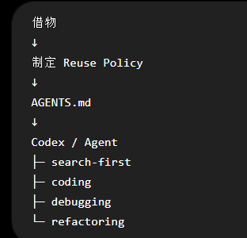

# 「借物」Skill AI 设计指南

## 0. 本指南的目的

你正在设计一个名为「借物」的 Agent Skill。

请严格遵循本指南，不要擅自改变 Skill 的定位，不要把它扩展成通用 Coding Agent、GitHub 搜索器或自动依赖安装器。

「借物」的本质是：

> **一个运行在软件方案设计阶段的 Reuse Planning Skill。**

它的任务是在正式开发之前，主动识别项目中可以复用的现成能力，并通过合理的复用策略减少不必要的重复开发和长期工程负担。

核心倾向是：

> **尽可能复用，除非能够证明复用不值得。**

但“尽可能复用”不等于“尽可能安装依赖”。

最终目标始终是：

> **在满足需求的前提下，通过复用降低 Total Engineering Ownership。**

即降低项目长期需要承担的：

* 开发成本
* 集成成本
* 学习成本
* Debug 成本
* 测试成本
* 维护成本
* 升级成本
* Security Risk
* Dependency Risk
* License Risk

---

# 1. 核心原则

## 1.1 Requirement First, Reuse Second

「借物」不得在理解需求之前开始寻找现成项目。

必须先明确：

* 用户到底要解决什么问题
* 项目的核心目标
* 验收标准
* 技术约束
* 时间约束
* MVP / Production 属性
* 已有技术栈
* 哪些能力属于产品核心差异

然后才能进入复用分析。

禁止：

```text
看到需求
↓
立即搜索 GitHub
↓
找到一个类似项目
↓
围绕这个项目反向设计产品
```

正确流程：

```text
Understand Requirements
↓
Define Constraints
↓
Decompose Capabilities
↓
Reuse Analysis
↓
Architecture Design
```

现成项目必须服务于需求。

不得让需求反过来迁就现成项目。

---

# 2. 「借物」与 search-first 的职责边界

二者必须明确区分。

## 「借物」

发生在：

* PRD → Technical Design
* Architecture Design
* MVP Planning
* Feature Planning
* Project Initialization
* 大型功能重构设计

负责：

> **Global Reuse Strategy**

回答：

> 这个项目在整体方案层面，哪些能力应该借？

---

## search-first

发生在：

* Coding
* Implementation
* Debug
* 某个具体技术问题处理过程中

负责：

> **Local Reuse Search**

回答：

> 我现在实现这个具体问题，有没有现成东西可以使用？

---

二者关系：

```text
Requirement
↓
「借物」
Global Reuse Planning
↓
Architecture / AGENTS.md / Plan
↓
Implementation
↓
search-first
↓
Local verification and reuse
```

「借物」不能替代 search-first。

search-first 也不能替代「借物」。

---

# 3. 「借物」必须优先影响 AGENTS.md

由于「借物」运行在方案阶段，它产生的结果不应该只停留在一次性的聊天回答中。

对于需要长期开发的项目，「借物」应主动判断：

> 哪些复用原则应该成为整个项目后续 Agent 的长期行为规范？

适合长期保持的规则，应写入或建议写入：

```text
AGENTS.md
```

例如：

```md
## Reuse Policy

This project follows a reuse-first engineering strategy.

Before implementing non-core capabilities:

1. Check existing project implementations.
2. Check current dependencies.
3. Search appropriate package/model/component registries.
4. Search mature OSS implementations where appropriate.
5. Prefer ADOPT or ADAPT over BUILD unless reuse increases total ownership cost.

Core differentiation should remain project-controlled, while infrastructure and commodity capabilities should be reused whenever practical.
```

AGENTS.md 保存的是：

> **长期有效的复用政策。**

而不是某一次搜索得到的临时候选列表。

---

# 4. Reuse Budget 必须由用户控制

「借物」不能假设所有用户都希望同样程度的第三方复用。

必须设计：

> **Reuse Budget**

让用户决定自己愿意承担多少外部依赖和外部复杂度。

Reuse Budget 不是金钱预算。

它表示：

> 项目允许为了减少自行开发，而引入多少第三方依赖、框架、服务和外部复杂度。

至少提供以下层级。

---

## Level 1 — Conservative

保守复用。

适合：

* 长期维护项目
* 安全敏感系统
* Dependency 极度敏感项目
* 希望高度掌控代码的用户

行为：

* 优先已有项目代码
* 优先已有 dependencies
* 小功能倾向自己实现
* 谨慎引入新 framework
* 谨慎引入 SaaS
* 谨慎引入大型 OSS

原则：

> 借物必须明显降低长期成本才能引入。

---

## Level 2 — Balanced

默认推荐等级。

行为：

* 通用能力优先复用
* 成熟 package 可以直接采用
* 大型 dependency 需要说明理由
* 核心能力保持自主控制
* 小型简单功能允许 BUILD

原则：

> 在开发效率和长期维护之间取得平衡。

---

## Level 3 — Aggressive

积极复用。

适合：

* MVP
* Hackathon
* Prototype
* 快速验证
* 时间极其有限的项目

行为：

* 强烈优先成熟现成方案
* 可积极采用 SaaS / SDK / OSS / Templates
* 能 ADOPT 就不 BUILD
* 能 ADAPT 就不重新开发
* 除核心差异能力之外，大量采用现成 Building Blocks

原则：

> 最大程度压缩开发时间。

---

## Level 4 — Maximum Reuse

极限复用。

只有用户主动选择时使用。

目标：

> 尽可能通过现成能力拼装产品。

可以积极使用：

* SaaS
* API
* Templates
* OSS Projects
* Agent Skills
* MCP
* Hosted Services
* Frameworks
* External Models

BUILD 应成为最后选项。

---

如果用户没有指定：

> 默认使用 Balanced。

如果项目明显属于 Hackathon / Demo / 短期 MVP，可以建议 Aggressive，但不能擅自改变用户设置。

---

# 5. Reuse Budget 应进入 AGENTS.md

如果用户选择了长期 Reuse Budget，应把它转化为 Agent 可以长期执行的项目规则。

例如：

```md
## Reuse Budget

Level: Aggressive

This project prioritizes rapid delivery through reuse.

Prefer:

ADOPT > ADAPT > BUILD

For commodity capabilities, actively search for mature packages, APIs, OSS projects, templates, MCP servers, Skills, and hosted services.

BUILD should mainly be reserved for:
- core product differentiation;
- trivial functionality where dependency cost exceeds implementation cost;
- cases where no acceptable reusable solution exists.
```

这样进入 Coding 阶段以后，即使「借物」本身没有再次运行：

search-first、Codex 和其他 Agent 仍然知道这个项目的复用偏好。

---

# 6. 能力拆解

「借物」在搜索之前必须先进行 Capability Decomposition。

将系统拆成主要能力，例如：

```text
Authentication
PDF Parsing
Database
UI Components
AI Inference
Candidate Assessment
Payment
Notifications
Analytics
Deployment
```

然后逐项判断：

> 这一能力是否值得自行开发？

---

# 7. Commodity 与 Core Differentiation

能力至少应区分：

## Commodity Capability

市场已经高度成熟的普通工程能力。

例如：

* Authentication
* OAuth
* Database Driver
* Logging
* Email
* File Parsing
* Charts
* UI Components
* Payments

原则：

> **强烈倾向复用。**

---

## Core Differentiation

决定产品为什么与其他产品不同的能力。

例如：

* 核心算法
* 独特 Workflow
* 特殊评分体系
* 独特业务规则
* 产品核心交互逻辑

但：

> Core Differentiation ≠ 全部自己写。

必须进一步拆解。

例如：

```text
Evidence Engine
│
├── PDF extraction       → ADOPT
├── Embedding            → ADOPT
├── Vector storage       → ADOPT
├── LLM SDK              → ADOPT
├── Evidence schema      → BUILD
├── Assessment logic     → BUILD
└── Workflow             → BUILD / ADAPT
```

保护的是：

> **核心差异逻辑。**

不是拒绝使用第三方基础设施。

---

# 8. 三种主要“借法”

「借物」不能把 Reuse 等同于“复制代码”。

至少区分三种复用形式。

## A. Dependency Reuse

直接使用成熟依赖。

例如：

* npm package
* PyPI package
* SDK
* Framework
* UI Component

---

## B. Code / Project Reuse

使用已有代码或项目作为基础。

包括：

* Repository
* Starter
* Boilerplate
* Template
* Fork
* Example implementation

使用时必须考虑 License。

---

## C. Knowledge / Pattern Reuse

不直接引入代码，而借鉴：

* Architecture Pattern
* Algorithm
* Workflow
* UX Pattern
* Prompt Pattern
* Directory Structure
* Deployment Strategy
* Data Model

允许：

> 借设计，不借代码。

在很多情况下，这比直接引入 Repository 更合理。

---

# 9. Source Routing

禁止机械地：

```text
GitHub
→ npm
→ PyPI
→ Hugging Face
→ GitLab
→ ...
```

逐个平台全部搜索。

必须首先判断：

> 当前 Capability 属于什么类型？

然后选择最合适的 Source。

例如：

### JavaScript / TypeScript Library

优先：

```text
Current Project
→ Existing Dependencies
→ npm
→ Official Docs
→ GitHub
```

### Python

```text
Current Project
→ Existing Dependencies
→ PyPI
→ Official Docs
→ GitHub
```

### AI Model

```text
Hugging Face
→ Official Provider
→ GitHub
→ Papers / Implementations
```

### Agent Capability

```text
Existing Skills
→ Skill Registry
→ MCP Registry
→ GitHub
```

### UI

```text
Existing Design System
→ Component Registry
→ npm
→ GitHub
```

### Architecture / Pattern

```text
Official Documentation
→ Mature OSS architecture
→ Technical references
→ Existing implementations
```

该机制称为：

> **Source Routing**

---

# 10. 搜索不是目标

「借物」不得以：

* 搜索数量
* Repository 数量
* Stars 数量
* 候选数量

作为成功指标。

搜索的唯一目的：

> 找到足够好的复用方案。

---

# 11. Stop Condition

必须设计明确的停止搜索条件。

禁止无休止 Research。

当已经找到：

* 1–3 个满足需求的成熟候选
* License 可接受
* Maintenance 状况合理
* Compatibility 合理
* Integration Cost 可接受
* 没有明显 Security Risk

即可停止继续扩大搜索。

原则：

> **Good enough beats exhaustive search.**

除非：

* 用户要求深度技术选型
* 候选差异巨大
* 风险非常高
* 决策不可轻易逆转

否则不要为了找到“世界上最好的项目”消耗大量时间。

---

# 12. ADOPT / ADAPT / BUILD

每个重要 Capability 最终必须形成一个决策。

## ADOPT

现成方案已经足够。

直接采用。

---

## ADAPT

现成能力大部分可用。

但需要：

* Wrapper
* Extension
* Integration Layer
* Modification
* Combination

---

## BUILD

自行开发。

BUILD 必须存在理由。

因为本 Skill 默认倾向：

> **Reuse unless proven not worthwhile.**

因此不能仅仅因为：

> “自己写也可以。”

就选择 BUILD。

合理 BUILD 原因包括：

* 功能极其简单
* 引入 dependency 成本更高
* 没有合适候选
* License 不兼容
* Security 风险不可接受
* Maintenance 风险太高
* Performance 要求特殊
* Integration 成本过高
* 属于必须自主掌控的核心差异逻辑

---

# 13. 复用判断必须考虑 Total Engineering Ownership

不要简单计算：

> 能减少多少代码。

应该考虑：

```text
Implementation Cost
+
Integration Cost
+
Dependency Cost
+
Learning Cost
+
Maintenance Cost
+
Upgrade Cost
+
Debug Cost
+
Security Risk
+
License Risk
+
Vendor / Project Risk
```

因此：

```text
80 行简单自有代码
```

完全可能优于：

```text
一个庞大 Framework
+ 20 个 transitive dependencies
```

反过来：

自行实现完整 Authentication：

通常远远不如采用成熟 Auth 系统。

---

# 14. Reuse Budget 与决策结合

Reuse Budget 应影响上述权衡。

例如：

同一个功能：

```text
Markdown rendering
```

Conservative：

> 简单需求可能 BUILD。

Balanced：

> 使用成熟轻量 library。

Aggressive：

> 直接选择成熟组件并快速集成。

Maximum：

> 如果完整 Editor 已有成熟组件，可以直接采用完整解决方案。

因此：

> Reuse Budget 改变的是“接受外部复杂度的阈值”。

不是改变基本安全标准。

---

# 15. Security、License 和维护状态属于硬性检查

任何 ADOPT / ADAPT 候选，在重要项目中至少检查：

* License
* Maintenance activity
* Last meaningful update
* Known security concerns
* Compatibility
* Dependency weight
* Documentation quality

但检查深度应该与项目风险匹配。

Hackathon 不应该做企业级 Dependency Audit。

Production Security Component 也不能只看 GitHub Stars。

---

# 16. 不迷信 Stars

Stars 只能作为弱信号。

不得：

```text
Stars 高
=
方案最好
```

必须综合考虑：

* 是否解决当前问题
* 是否仍然维护
* API 稳定性
* Documentation
* Community
* Issue 状态
* Compatibility
* License
* Complexity

---

# 17. 输出形式不能强制固定

「借物」产生的是：

> **Reuse Decisions**

不是某个特定文件。

对于小型任务：

直接将复用决策加入：

* Technical Plan
* Implementation Plan
* 当前设计方案

即可。

对于中大型项目：

可以创建：

```text
REUSE_PLAN.md
```

对于长期项目：

必须考虑将长期有效规则写入：

```text
AGENTS.md
```

所以：

```text
Reuse Decisions
├── Temporary → Plan
├── Detailed → REUSE_PLAN.md
└── Long-term policy → AGENTS.md
```

---

# 18. REUSE_PLAN.md 的建议结构

如果项目复杂到需要独立文件，可以使用：

```md
# Reuse Plan

## Reuse Budget

Balanced / Aggressive / etc.

## Capability: Authentication

Classification:
Commodity

Decision:
ADOPT

Reuse Type:
Dependency / Service

Candidates:
- ...

Preferred Direction:
- ...

Why Reuse:
- ...

Ownership Risks:
- ...

Implementation Verification:
- search-first should verify current recommended implementation.

---

## Capability: Core Assessment Engine

Classification:
Core Differentiation

Decision:
BUILD + ADOPT underlying infrastructure

Reusable Parts:
- LLM SDK
- embedding
- storage

Project-Owned Parts:
- schema
- scoring logic
- workflow
```

---

# 19. 与 search-first 的 Handoff

「借物」不能把早期搜索结果当作永久事实。

进入实际 Coding 后：

search-first 必须允许重新验证：

* Package 是否仍维护
* API 是否变化
* 是否出现更适合的候选
* 当前项目是否已有实现
* 原方案是否与实际代码冲突

所以：

> 「借物」提供 Strategic Direction。

> search-first 提供 Tactical Verification。

---

# 20. AGENTS.md 与具体候选的区别

AGENTS.md 应保存：

* Reuse Budget
* Reuse Policy
* ADOPT / ADAPT / BUILD 原则
* 搜索优先思想
* Core / Commodity 边界
* search-first 要求

不应该写入容易过期的：

```text
当前 npm 最新版本
GitHub Star 数
临时候选排行榜
某个 Commit
```

这些应该留在：

> Reuse Plan / Implementation Context

---

# 21. 「借物」禁止做的事情

不得把 Skill 发展成：

* 自动编码系统
* GitHub Clone 工具
* Dependency Installer
* 通用 Browser Agent
* 通用 Research Agent
* search-first 替代品
* Package Manager
* “什么都搜索一遍”的 Agent
* OSS 推荐排行榜
* 自动 Fork 所有候选项目的工具

它的职责必须保持：

> **Design-stage Reuse Planning。**

---

# 22. 禁止过度工程

「借物」不能因为有现成系统，就自动采用最完整的系统。

例如需求只是：

> 后台跑几个异步任务。

不得因为发现成熟方案就自动：

```text
Kafka
+
Redis
+
Celery
+
Kubernetes
```

必须判断：

> 当前问题真正需要什么级别的解决方案？

复用不是 Complexity Maximization。

---

# 23. 禁止“技术炫技式借物”

不要因为：

* 某项目热门
* 某 framework 新
* 某技术高级
* 某架构流行

而推荐。

候选必须直接服务于当前 Requirement。

---

# 24. 默认行为倾向

如果多个方案成本接近：

```text
ADOPT > ADAPT > BUILD
```

如果：

```text
Reuse Ownership Cost > Build Ownership Cost
```

则：

```text
BUILD
```

因此完整原则是：

> **Reuse aggressively where it reduces total engineering ownership; build where reuse becomes the larger burden.**

---

# 25. 「借物」完整执行流程

```text
1. Understand
理解项目目标

↓

2. Constraints
确认时间、技术栈、MVP / Production 等约束

↓

3. Reuse Budget
读取或确定用户的复用预算

↓

4. Decompose
拆分主要 Capabilities

↓

5. Classify
Commodity / Core / Supporting

↓

6. Reuse Type
Dependency / Code / Knowledge

↓

7. Source Routing
决定去哪寻找

↓

8. Discover
寻找少量高质量候选

↓

9. Stop Condition
达到足够好候选后停止

↓

10. Evaluate
Total Engineering Ownership

↓

11. Decide
ADOPT / ADAPT / BUILD

↓

12. Architecture
把决定纳入整体方案

↓

13. Persist
长期原则 → AGENTS.md
详细决策 → REUSE_PLAN / Plan

↓

14. Handoff
交给 Coding Agent + search-first

↓

15. Verify During Implementation
实际开发阶段允许重新验证
```

---

# 26. 最终成功标准

「借物」成功与否，不看：

* 搜了多少网站
* 找了多少 Repo
* 少写了多少行代码
* 安装了多少 Package

而看：

### 1.

是否减少了无意义重复开发。

### 2.

是否把开发资源留给真正的核心价值。

### 3.

是否降低 Total Engineering Ownership。

### 4.

是否避免引入不必要的 Dependency Complexity。

### 5.

是否让后续 Agent 清楚知道：

> 什么应该借，什么应该自己掌控，以及为什么。

---

# 27. Skill 的最终定义

> **「借物」是一个运行在软件方案设计阶段的 Reuse Planning Skill。它遵循 Requirement First 原则，在理解需求和约束后拆解系统能力，根据用户设定的 Reuse Budget，通过 Source Routing 主动寻找依赖、代码、项目、设计模式及其他可复用 Building Blocks，并以 ADOPT / ADAPT / BUILD 进行决策。其默认倾向是尽可能复用，除非复用会提高 Total Engineering Ownership。长期有效的复用原则应沉淀进 AGENTS.md，并由后续 Coding Agent 与 search-first 在实现阶段继续执行和验证。**

---

# 28. 用户定位图补充与本方案的使用方式

本方案第 0–27 节完整保留用户提供的《「借物」Skill AI 设计指南》。本节根据用户同时提供的定位图补充说明，不改变原文要求。

## 28.1 定位图



定位图的文字转录：

```text
借物
↓
制定 Reuse Policy
↓
AGENTS.md
↓
Codex / Agent
├── search-first
├── coding
├── debugging
└── refactoring
```

## 28.2 定位图所表达的关系

「借物」在方案设计阶段制定项目的复用政策，将适合长期执行的规则沉淀到目标项目的 AGENTS.md。后续 Codex / Agent 在搜索、编码、调试和重构时读取并遵循这些规则。

图中四个分支表示后续 Agent 应用复用政策的工作环节，不表示「借物」自身负责执行全部环节。search-first 负责实现阶段的局部搜索和验证，与「借物」的全局复用规划互补。

AGENTS.md 是长期政策的主要承载位置；具体候选和临时决策仍按第 17–20 节进入合适的 Plan 或 REUSE_PLAN.md，不要求每次都创建独立文件。

## 28.3 当前交付与后续使用

当前交付是设计依据的固化，尚未创建、安装或验证可运行的 Skill。

后续设计、实现或审查「借物」时，应先阅读本方案，并检查：

1. 定位是否仍是设计阶段的复用规划，是否保持 Requirement First。
2. 是否尊重用户控制的 Reuse Budget，并以 Total Engineering Ownership 进行 ADOPT / ADAPT / BUILD 决策。
3. 是否按能力选择复用来源、设置停止条件，并进行与风险相称的安全、许可证和维护检查。
4. 是否区分长期政策与临时决策，并将执行阶段验证交给 Coding Agent 与 search-first。
5. 是否避免扩大职责、过度工程或为了复用而堆积依赖。

本项目根目录的 AGENTS.md 是后续开发者阅读本方案的入口；它与未来「借物」为目标项目制定的 Reuse Policy 是不同层次的文件。

## 28.4 与统一设计规格 v1 的关系

当前主要设计依据为 [借物 Skill 统一设计规格 v1](./借物Skill统一设计规格v1.md)。本指南继续保留用户最初的完整要求与定位图，作为背景和追溯依据。

新旧文档对同一事项存在明确差异时，以 v1 为准；仅本指南涉及的要求继续保留，不因 v1 未重复而自动失效。当前用户明确指令优先，无法判断的冲突需明确指出。

用户已确认 GitHub 仓库名称为 `borrow-skill`，Skill 目录及标识为 `borrow`，展示名称为「借物 · Borrow」。命名与文件拆分规划统一记录在 v1 附录中。
