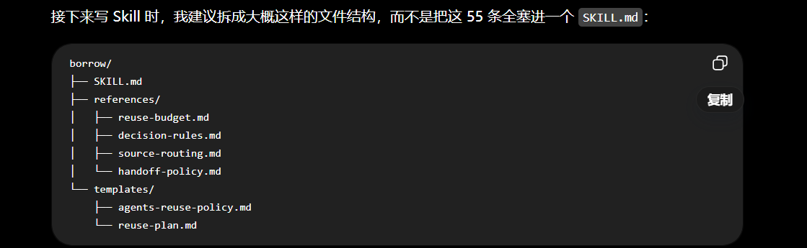

# 「借物」Skill 统一设计规格 v1

## 一、Skill 定位

「借物」是一个运行在软件方案设计阶段的 **Reuse Planning Skill**。

它的目标不是单纯“去 GitHub 搜代码”，也不是替代 Coding Agent，而是在正式开发前：

* 拆解项目能力；
* 判断哪些能力没有必要自行开发；
* 寻找可复用的依赖、代码、项目、设计模式与知识；
* 形成 ADOPT / ADAPT / BUILD 决策；
* 将复用战略纳入整体架构；
* 将长期复用政策沉淀进 AGENTS.md；
* 把实现阶段需要重新验证的内容交给 search-first 等后续 Agent。

核心倾向：

> 尽可能复用，除非能够证明复用不值得。

最终优化目标：

> 降低 Total Engineering Ownership，而不是单纯减少代码行数或提高复用比例。

---

# 二、核心设计原则

## 1. Requirement First, Reuse Second

必须先明确：

* 用户真正要解决的问题；
* 项目目标；
* 验收标准；
* MVP / Prototype / Production 属性；
* 技术与部署约束；
* 时间限制；
* 用户明确技术选择；
* 哪些能力属于核心差异。

然后才能进入复用分析。

禁止先找到现成项目，再反过来让需求迁就项目。

---

## 2. Reuse First, but not Reuse at Any Cost

默认优先级：

> ADOPT > ADAPT > BUILD

但前提是：

> 复用不会让项目承担更高的总体工程成本。

复用不是 KPI。

BUILD 也是合法决策，但需要明确理由。

---

## 3. 优化 Total Engineering Ownership

决策不能只比较：

> 少写多少代码。

必须综合考虑：

* Implementation Cost
* Integration Cost
* Learning Cost
* Testing Cost
* Debug Cost
* Maintenance Cost
* Upgrade Cost
* Dependency Cost
* Security Risk
* License Risk
* Vendor / Project Risk
* Replaceability

因此：

> 80 行简单稳定的自有代码，可能优于引入一个庞大 Framework。

反过来：

> 自己重新实现成熟 Authentication，通常远比复用成熟方案代价更高。

---

# 三、「借物」与 search-first 的关系

## 「借物」

运行在：

* Project Planning
* Architecture Design
* Technical Design
* MVP Planning
* Feature Planning
* Major Refactor
* Migration Planning
* System Redesign

负责：

> Global Reuse Strategy

核心问题：

> 整体方案里，哪些能力应该借？

---

## search-first

运行在：

* Coding
* Implementation
* Debugging
* 某个具体实现问题

负责：

> Local Reuse Search

核心问题：

> 我现在处理的这个具体问题，有没有现成方案可用？

---

## 二者关系

```text
Requirement
↓
「借物」
Global Reuse Planning
↓
Architecture / Plan / AGENTS.md
↓
Implementation
↓
search-first
↓
Local Verification
↓
Integrate / Adapt / Build
```

「借物」负责战略。

search-first 负责执行阶段重新验证。

---

# 四、触发条件

「借物」支持两种触发方式。

## 1. Explicit Trigger

用户明确要求：

* 用借物设计；
* 先找可以复用的东西；
* 尽量不要重复造轮子；
* 先看看哪些能力能借。

此时直接触发。

---

## 2. Automatic Trigger

用户未明确提到「借物」，但当前任务满足：

```text
Design / Planning Stage
+
Meaningful Capability Scope
+
Plausible Reuse Opportunity
```

例如：

* 新项目设计；
* 大功能设计；
* 架构规划；
* MVP 设计；
* Hackathon 方案；
* 系统重构；
* 技术迁移；
* 技术选型。

---

# 五、自动触发 Gate

## Stage Gate

当前是否正在决定：

> “这个东西应该怎么做？”

如果只是：

* 修 Bug；
* 改一个函数；
* 改 CSS；
* 解释代码；
* 具体实现某个已确定功能；

默认不启动完整「借物」。

---

## Scope Gate

当前任务是否大到值得拆成独立 Capability？

例如：

> 设计用户系统。

适合。

而：

> 写一个时间格式化函数。

通常不适合。

---

## Reuse Opportunity Gate

是否存在合理复用空间？

例如：

* Auth
* Database
* UI
* AI Model
* Parsing
* Agent
* API
* Infrastructure
* Payment

通常有明显复用价值。

---

# 六、重新触发规则

「借物」绑定的是：

> 设计阶段。

不是：

> 项目只能运行一次。

如果项目已经开始 Coding，但用户说：

> 当前架构不合适，需要重新设计。

则重新进入设计阶段，可以再次触发「借物」。

---

# 七、输入设计

「借物」不要求用户填写复杂表单。

优先从：

* 当前对话；
* 项目文件；
* AGENTS.md；
* 现有 architecture；
* 当前 dependencies；
* 用户已经给出的限制；

中自动获取信息。

---

# 八、核心输入

至少需要理解：

## Project Goal

项目到底要解决什么问题？

---

## Acceptance Target

做到什么程度算成功？

例如：

* Prototype
* Hackathon Demo
* MVP
* Internal Tool
* Production

---

## Existing Project Context

如果已有项目，应理解：

* 当前技术栈；
* 当前 Repo；
* Existing Dependencies；
* Existing Services；
* Existing Infrastructure；
* Existing Skills / MCP；
* AGENTS.md；
* 已有架构与技术决定。

---

# 九、Reuse Budget

Reuse Budget 由用户控制。

它决定：

> 项目愿意为了减少自行开发，而承担多少第三方依赖和外部复杂度。

支持四级。

---

## Level 1 — Conservative

特点：

* 优先内部已有代码；
* 偏好轻量依赖；
* 谨慎增加 Framework / SaaS；
* 简单功能更容易选择 BUILD；
* 只有复用明显降低长期成本时才引入。

适合：

* 长期维护；
* 安全敏感；
* 强控制需求。

---

## Level 2 — Balanced

默认等级。

特点：

* 通用能力优先复用；
* 成熟 package 可直接采用；
* 大型 dependency 需要理由；
* 简单功能允许 BUILD；
* 在开发效率与长期维护之间平衡。

---

## Level 3 — Aggressive

特点：

* 明显倾向 ADOPT / ADAPT；
* 大量使用成熟 Package / SaaS / SDK / OSS；
* BUILD 主要留给核心差异；
* 优先压缩开发时间。

适合：

* MVP；
* Hackathon；
* 快速验证。

---

## Level 4 — Maximum Reuse

特点：

> 默认问题变成“有没有理由不能借？”

大量使用：

* SaaS
* API
* Framework
* OSS
* Templates
* MCP
* Agent Skills
* Hosted Services

BUILD 是最后选项。

只应由用户主动选择。

---

# 十、Reuse Budget 默认与优先级

如果用户没有指定：

> 默认 Balanced。

如果项目明显是 Hackathon / Demo：

可以建议 Aggressive，但不能擅自替用户改变。

优先级：

```text
Current User Instruction
>
AGENTS.md
>
Current Design Document
>
Skill Default
```

---

# 十一、Reuse Budget 持久化

如果 Reuse Budget 属于项目长期规则，应写入：

```text
AGENTS.md
```

AGENTS.md 保存：

* Reuse Budget；
* Reuse-first Policy；
* ADOPT / ADAPT / BUILD 偏好；
* Core / Commodity 原则；
* search-first 要求；
* Source Routing 原则；
* Total Ownership 原则。

不保存：

* 当前版本号；
* Repo Stars；
* 临时候选；
* 易过期搜索结果。

---

# 十二、Capability Decomposition

正式搜索前，必须拆解主要能力。

例如：

```text
Recruitment Platform

├── Authentication
├── Resume Upload
├── PDF Parsing
├── Candidate Storage
├── LLM Analysis
├── Evidence Extraction
├── Assessment Logic
├── Dashboard
└── Export
```

拆解粒度应达到：

> 可以独立做 Build-vs-Reuse 决策。

不能太粗：

```text
Frontend / Backend / AI
```

也不能细到每个按钮和工具函数。

---

# 十三、Capability Classification

每个主要 Capability 至少分类为：

## Commodity

高度成熟、通用能力。

默认：

> Reuse-first。

例如：

* Auth
* Logging
* Email
* Database Driver
* File Parsing
* Charts
* Payment SDK

---

## Supporting

不是核心差异，但可能有项目特定需求。

例如：

* Workflow
* Search Pipeline
* Data Transformation
* Orchestration

默认：

> ADOPT / ADAPT 优先。

---

## Core Differentiation

决定产品独特价值的能力。

原则：

> 核心差异逻辑保持项目控制。

但不意味着：

> 整个 Core Capability 全部 BUILD。

应继续拆解：

```text
Infrastructure Layer → Reuse
Differentiation Layer → Project-owned
```

---

# 十四、三类 Reuse Type

「借物」至少区分三种借法。

## Dependency Reuse

直接使用：

* Package
* SDK
* Framework
* Hosted Service
* API
* Component

---

## Code / Project Reuse

使用：

* Repo
* Starter
* Boilerplate
* Template
* Fork
* Reference Implementation

需要特别检查 License 与长期维护成本。

---

## Knowledge / Pattern Reuse

借：

* Architecture
* Algorithm
* Workflow
* UX Pattern
* Prompt Pattern
* Data Model
* Deployment Strategy
* Directory Structure

允许：

> 借设计，不借代码。

---

# 十五、优先低耦合复用

原则：

> 复用所需能力，而不是尽可能复用整个项目。

如果：

* 借一个 Pattern 就够；

不要 Fork 整个项目。

如果：

* 一个轻量 package 就够；

不要引入完整 Framework。

如果：

* Wrapper / Adapter 可以解决；

优先于复制代码后大规模魔改。

---

# 十六、执行流程

完整执行状态机：

```text
1. Lock Requirements
↓
2. Read Project Context
↓
3. Resolve Reuse Budget
↓
4. Capability Decomposition
↓
5. Capability Classification
↓
6. Reuse Opportunity Analysis
↓
7. Source Routing
↓
8. Candidate Discovery
↓
9. Candidate Filtering
↓
10. Reuse Decision
↓
11. Architecture Integration
↓
12. Persist Policy
↓
13. Handoff
```

---

# 十七、Phase 1 — Lock Requirements

形成一个足够稳定的：

> Requirement Snapshot

至少明确：

* 项目目标；
* Acceptance Target；
* 技术约束；
* 时间约束；
* 平台限制；
* 用户明确选择；
* 核心差异。

它不是完整 PRD。

只是为了防止：

> 找到现成项目后反向扭曲需求。

---

# 十八、允许优化实现方式，但不能改变目标

可以挑战：

> “必须用 Kafka。”

如果有明显更低成本方案。

但不能未经用户理由改变：

> “需要可靠异步任务处理。”

即：

> 可以优化 implementation idea，但不能随意修改 user goal。

---

# 十九、Phase 2 — 先向内借

外部搜索之前必须优先检查：

* Existing Code
* Existing Dependencies
* Existing Services
* Existing Infrastructure
* Existing Patterns
* Existing Skills / MCP
* Existing Architecture

因为：

> 已存在能力通常拥有最低新增集成成本。

---

# 二十、内部已有 ≠ 必须继续使用

如果现有方案：

* 明显不合适；
* 已成技术债；
* 安全风险严重；
* 即将弃用；
* 继续使用成本更高；

可以替换。

仍然以：

> Total Engineering Ownership

判断。

---

# 二十一、Phase 3 — Resolve Reuse Budget

正式决策前必须确定 Reuse Budget。

它改变的是：

> 对外部复杂度的容忍阈值。

不会降低：

* Security 基本要求；
* License 基本要求；
* Requirement Match；
* Correctness。

---

# 二十二、Phase 4 — Capability Decomposition

不能以整个产品直接搜索：

> “找一个和我产品一样的 Repo。”

应先拆能力，再逐项判断。

完整项目只能作为：

* Starter 候选；
* Reference Architecture；
* Knowledge Reuse；

不能默认直接 Fork。

---

# 二十三、Phase 5 — Capability Classification

分类后形成默认倾向：

```text
Commodity
→ Reuse-first

Supporting
→ ADOPT / ADAPT first

Core
→ Project controls differentiation
  while reusing infrastructure
```

---

# 二十四、Phase 6 — Reuse Opportunity Analysis

对每个 Capability 判断：

* Dependency Reuse？
* Code / Project Reuse？
* Knowledge / Pattern Reuse？
* 多种方式组合？

例如：

```text
Core Assessment Engine

LLM SDK → Dependency Reuse
Prompt Pattern → Knowledge Reuse
Evaluation Schema → BUILD
Scoring Logic → BUILD
```

---

# 二十五、Phase 7 — Source Routing

不能机械地所有平台搜索一遍。

必须先判断：

> 需要什么类型的资源？

再选择来源。

---

## JavaScript / TypeScript

优先：

```text
Current Project
→ Existing Dependencies
→ npm
→ Official Docs
→ GitHub
```

---

## Python

```text
Current Project
→ Existing Dependencies
→ PyPI
→ Official Docs
→ GitHub
```

---

## UI

```text
Existing Design System
→ Component Registry
→ npm
→ GitHub
```

---

## AI Model / Dataset

```text
Hugging Face
→ Official Provider
→ GitHub
→ Research Implementation
```

---

## Agent Capability

```text
Existing Skills
→ Skill Registry
→ MCP Registry
→ GitHub
```

---

## Architecture / Pattern

```text
Official Documentation
→ Mature OSS
→ Reference Architecture
→ Known Technical Patterns
```

---

## Complete Application / Starter

```text
GitHub
→ GitLab
→ Codeberg
→ Template Ecosystem
```

---

# 二十六、Source Routing 不是固定平台名单

Skill 应保存：

> “根据资源类型选择最有效来源。”

而不是把某个平台列表硬编码成不可改变的规则。

未来可以增加：

* 新 Registry；
* 新 Skill 平台；
* 新模型平台；
* 企业内部源。

---

# 二十七、Phase 8 — Candidate Discovery

目标：

> 找少量高质量候选。

默认：

```text
1–3 个候选
```

已经足够。

优先：

* Official
* Mature
* Active
* Well-documented
* Widely-used
* Requirement-fit

而不是：

> 只要存在就算候选。

---

# 二十八、Phase 9 — Hard Filter

以下情况可以直接淘汰：

## Requirement mismatch

无法满足核心需求。

## License unacceptable

License 与项目用途冲突。

## Security unacceptable

存在不可接受风险。

## Platform incompatible

当前环境无法合理使用。

## Abandoned + High Risk

长期停止维护且项目将深度依赖。

## Integration infeasible

集成复杂度超出项目约束。

---

# 二十九、Hard Filter 不受 Reuse Budget 放宽

即使：

> Maximum Reuse

也不能接受：

* 明显违法 License；
* 无法满足需求；
* 严重安全问题；
* 完全无法维护。

Reuse Budget 调整的是：

> 复杂度容忍。

不是：

> 风险底线。

---

# 三十、Phase 10 — Soft Evaluation

通过 Hard Filter 后比较：

* Requirement Fit
* Integration Cost
* Maintenance Cost
* Learning Cost
* Dependency Weight
* Documentation Quality
* Maturity
* Extensibility
* Replaceability
* Security Surface
* Vendor Lock-in
* Upgrade Cost

默认使用：

> 相对比较。

不制造没有意义的 87.3 / 82.7 伪精确评分。

---

# 三十一、核心比较

最终比较：

```text
Reuse Ownership Cost
VS
Build Ownership Cost
```

---

## Reuse Ownership Cost

包括：

* Integration
* Learning
* Dependency
* Maintenance
* Upgrade
* Security
* License
* Vendor Risk
* Debug Complexity

---

## Build Ownership Cost

包括：

* Implementation
* Testing
* Debugging
* Maintenance
* Security Responsibility
* Future Feature Work

---

# 三十二、ADOPT 决策规则

当：

```text
现成方案满足需求
+
无明显 Hard Blocker
+
集成成本合理
+
长期成本合理
```

应选择：

> ADOPT

无需为了“体现原创性”重新实现。

---

# 三十三、ADAPT 决策规则

当：

> 现成方案解决了主要难点，但还需要项目特定修改。

可以：

* Wrapper
* Adapter
* Extension
* Composition
* Plugin
* Partial Reuse
* 必要时 Fork

但应优先：

> 保持上游可升级性。

---

# 三十四、BUILD 决策规则

BUILD 合理场景包括：

* 核心差异逻辑；
* 极小稳定功能；
* 第三方明显过重；
* Security 风险；
* License 不可接受；
* 没有可靠方案；
* 特殊性能 / 隐私要求；
* 严重 Vendor Lock-in；
* Reuse Ownership Cost 高于 Build Ownership Cost。

---

# 三十五、BUILD Evidence Burden

由于本 Skill 的默认倾向是：

> Reuse unless proven not worthwhile.

因此：

> BUILD 需要明确理由。

不能仅仅因为：

> “自己写也不难。”

就选择 BUILD。

---

# 三十六、Stop Condition

搜索必须有明确停止条件。

默认当：

```text
至少存在一个满足需求的候选
+
无 Hard Blocker
+
成本符合当前 Reuse Budget
+
已经足以做出 ADOPT / ADAPT / BUILD 决策
```

即可停止。

---

# 三十七、候选数量原则

如果：

> 有一个明显优秀候选。

可以直接停止。

否则：

> 比较 2–3 个候选。

通常足够。

禁止默认搜 10–20 个然后做排行榜。

---

# 三十八、高影响决策

以下能力可以提高搜索深度：

* Authentication
* Payment
* Core Database
* Security Infrastructure
* Major Framework
* Vendor-dependent Infrastructure
* 难替换平台

原因：

> Switching Cost 高。

---

# 三十九、低影响决策

例如：

* Markdown Renderer
* Icon Library
* Simple Chart
* Date Formatting

找到成熟合适方案：

> 尽快停止。

不要浪费时间寻找“世界最佳”。

---

# 四十、Search Escalation

如果当前 Source 没找到：

```text
Primary Source
↓
Secondary Source
↓
Broader OSS Search
↓
Knowledge / Pattern Reuse
↓
BUILD
```

不能：

> 第一个地方没找到就立即 BUILD。

也不能无限搜索。

---

# 四十一、搜索失败也是合法结果

经过合理搜索仍无合适方案：

```text
Decision: BUILD
Reason:
No suitable reusable solution found within reasonable search scope.
```

属于正确结果。

---

# 四十二、Architecture Integration

复用决策必须真正改变整体设计。

不能只是：

> 列几个推荐库。

每个重要能力都要明确：

## External Ownership

什么交给第三方？

## Project Ownership

什么由项目继续掌控？

---

例如：

```text
Authentication

External:
- Identity verification
- Session
- Password reset

Project:
- Role model
- Permission rules
- Business authorization
```

这形成：

> Ownership Boundary。

---

# 四十三、持久化输出

复用决策分成三种持久化方式。

## 小任务

直接写入当前方案：

```text
Reuse Decisions
```

不创建新文件。

---

## 普通项目

写入：

* PLAN.md
* ARCHITECTURE.md
* Technical Design

---

## 大型 / 复杂项目

可单独生成：

```text
REUSE_PLAN.md
```

---

# 四十四、AGENTS.md 与 REUSE_PLAN 的边界

## AGENTS.md

回答：

> 以后所有 Agent 应该遵守什么复用政策？

保存长期规则。

---

## REUSE_PLAN.md

回答：

> 这个具体项目当前准备怎么借？

保存当前具体设计决策。

---

# 四十五、REUSE_PLAN.md 不是强制文件

Reuse Plan 是：

> 一种输出形式。

不是 Skill 本体。

原则：

```text
Small
→ Inline

Standard
→ Plan / Architecture Section

Complex
→ REUSE_PLAN.md
```

避免文档膨胀。

---

# 四十六、核心输出：Capability Reuse Map

完整「借物」执行应该形成：

| Capability      | Classification | Decision | Reuse Type             | Direction |
| --------------- | -------------- | -------- | ---------------------- | --------- |
| Authentication  | Commodity      | ADOPT    | Dependency / Service   | 成熟 Auth   |
| PDF Parsing     | Commodity      | ADOPT    | Dependency             | 成熟 Parser |
| Evidence Engine | Core           | ADAPT    | Dependency + Knowledge | 借底层，保留核心  |
| Scoring Logic   | Core           | BUILD    | Knowledge              | 自主实现      |

这是 Skill 的核心交付物之一。

---

# 四十七、每个重要 Capability 的最小输出

至少记录：

```text
Capability
Classification
Decision
Reuse Type
Recommended Direction
Why
Project-owned Boundary
Implementation Handoff
```

---

# 四十八、决策强度分级

设计阶段所有决定分为：

## POLICY

长期项目规则。

通常进入 AGENTS.md。

---

## DECISION

当前方案已确定。

后续 Agent 应遵守，除非出现新证据。

---

## PREFERENCE

当前推荐。

search-first 可以在实施阶段推翻。

---

## OPEN

当前无法或无需确定。

留给实现阶段解决。

---

# 四十九、Handoff

每个重要决策应告诉后续 Agent：

* What is fixed?
* What is preferred?
* What must be revalidated?
* What may change?

例如：

```text
Strategic Decision:
Use mature authentication solution.

Preferred:
Supabase Auth.

Not Fixed:
Exact SDK version.

Implementation Handoff:
search-first must verify current compatibility before integration.
```

---

# 五十、特殊规则

## 简单功能

必须比较：

```text
Tiny Build
VS
New Dependency
```

避免为了复用制造 Dependency Explosion。

---

## 安全敏感能力

包括：

* Authentication
* Cryptography
* Payment
* Secret Management
* Permission Enforcement

默认优先成熟可信方案。

不鼓励无明确理由自行重写安全基础设施。

---

## 完整 OSS 项目

发现与目标高度相似的项目时：

不能直接默认 Fork。

先判断：

```text
Dependency?
Component?
Pattern?
Reference?
Fork?
```

很多时候：

> 借设计比借整个项目更合理。

---

## 用户明确技术选择

例如用户明确：

> 使用 PostgreSQL。

默认将其视为：

> Constraint。

不应无故重新进行数据库选型。

除非与需求明显冲突。

---

## Replaceability

同等条件下：

> 优先更容易替换的方案。

例如：

> Provider Interface / Adapter

通常优于业务逻辑深度绑定 Vendor SDK。

---

## 避免未来假设驱动的过度设计

基于：

> 当前 Requirement + 合理可见未来。

而不是：

> “以后可能一亿用户。”

---

# 五十一、主要失败模式

## Reuse Addiction

什么都装 Package。

纠正：

> 比较 Dependency Cost 与 Tiny Build。

---

## NIH Syndrome

因为“自己写更可控”而拒绝成熟方案。

纠正：

> BUILD 必须有理由。

---

## GitHub Shopping

不断找 Repo，但不做决定。

纠正：

> Stop Condition。

---

## Architecture Hijacking

现成项目开始绑架产品需求。

纠正：

> Requirement First。

---

## Dependency Hoarding

“以后可能有用”就安装。

纠正：

> 只引入当前明确需要的能力。

---

## Premature Fork

看到类似项目直接 Fork。

纠正：

先判断：

> Dependency / Component / Pattern / Fork

哪种复用方式成本最低。

---

# 五十二、Skill 不负责什么

「借物」不是：

* Coding Agent
* GitHub Search Tool
* Package Manager
* Dependency Installer
* 自动 Clone 工具
* 通用 Research Agent
* search-first 替代品
* OSS 排行榜
* 自动 Fork Agent

它负责：

> Design-stage Reuse Planning。

---

# 五十三、最终 I/O Contract

```text
INPUT

Project Goal
+
Acceptance Target
+
Existing Project Context
+
Reuse Budget
+
Relevant Constraints
+
User Preferences

↓
「借物」
↓

OUTPUT

Capability Reuse Map
+
ADOPT / ADAPT / BUILD Decisions
+
Reuse Type
+
Ownership Boundaries
+
Architecture Impact
+
Decision Strength
+
Implementation Handoff
+
AGENTS.md Reuse Policy
+
Optional Plan / REUSE_PLAN.md
+
Risks / Assumptions / Open Questions
```

---

# 五十四、最终核心规则

如果未来压缩 SKILL.md，只能保留少数规则时，以下规则必须保留：

1. Requirement First.
2. Check existing capabilities before external search.
3. Prefer ADOPT, then ADAPT, then BUILD when costs are comparable.
4. BUILD requires explicit justification.
5. Reuse the needed capability, not automatically the whole project.
6. Core differentiation stays project-controlled, while infrastructure may still be reused.
7. Route searches according to resource type.
8. Stop when a good-enough solution exists.
9. Optimize Total Engineering Ownership, not code count or reuse percentage.
10. Respect the user-selected Reuse Budget.
11. Persist long-term reuse rules into AGENTS.md.
12. Leave implementation-stage verification to search-first where appropriate.

---

# 五十五、Skill 一句话定义

> 「借物」是一个运行在软件方案设计阶段的 Reuse Planning Skill。它先理解需求和工程约束，再根据用户设定的 Reuse Budget 拆解系统能力，通过 Dependency Reuse、Code / Project Reuse 与 Knowledge / Pattern Reuse 三种方式寻找可复用能力，并通过 ADOPT / ADAPT / BUILD 形成架构级决策。其默认倾向是尽可能复用，除非复用会提高 Total Engineering Ownership。长期复用政策应沉淀进 AGENTS.md，具体实现则交由后续 Agent 和 search-first 在 Coding 阶段继续验证。

---

# 附录：项目落地记录（与用户原始规格正文分开）

正文完整保留用户提供的《「借物」Skill 统一设计规格 v1》。本附录记录命名、文档关系及后续文件拆分；不改写正文，也不代表 Skill 已实现或经过行为验证。

## A. 已确认命名

| 用途 | 名称 |
| --- | --- |
| GitHub 仓库 | `borrow-skill` |
| Skill 目录及标识 | `borrow` |
| 展示名称 | 借物 · Borrow |
| 英文定位 | A design-stage reuse planning skill for AI coding agents. |

仓库简介文案：

> Plan what to adopt, adapt, or build before coding, and capture lasting reuse policies in AGENTS.md.

已创建私有 GitHub 仓库：[lagebattoo/borrow-skill](https://github.com/lagebattoo/borrow-skill)，本地项目已关联该仓库。Skill 尚未发布。

## B. 文档关系与当前状态

本文件是当前主要设计依据；[原始指导方案](./借物Skill指导方案.md) 保留最初要求与定位图，用于补充背景和追溯。新旧文档对同一事项存在明确差异时，以 v1 为准；仅旧指南涉及的要求继续保留。当前用户明确指令优先；无法判断的冲突需明确指出。

项目根目录的 [AGENTS.md](./AGENTS.md) 指引本 Skill 的设计与开发；未来 Skill 输出到目标项目的 AGENTS.md Reuse Policy 是另一层规则，不应混淆。

| 阶段 | 当前状态 |
| --- | --- |
| 1. 定位与边界 | 已形成设计规格 |
| 2. 触发条件与输入输出 | 已形成设计规格 |
| 3. 执行流程与决策规则 | 已形成设计规格，少量执行细节待完善 |
| 4. 编写 Skill 文件 | v1 已归档，Skill 文件尚未编写 |
| 5. 案例验证与调整 | 尚未执行 |

“已形成设计规格”不等于已通过实际行为验证。

## C. 文件拆分规划

用户提供的结构建议图：



以下为后续实现规划，本次不创建空目录或占位文件：

```text
borrow/
├── SKILL.md
├── references/
│   ├── reuse-budget.md
│   ├── decision-rules.md
│   ├── source-routing.md
│   └── handoff-policy.md
└── templates/
    ├── agents-reuse-policy.md
    └── reuse-plan.md
```

| 规划文件 | 主要职责 | 对应规格内容 |
| --- | --- | --- |
| `borrow/SKILL.md` | 定位、触发条件、输入获取、核心流程、必留规则、按需引用入口 | 一至八、十六、五十二至五十五 |
| `borrow/references/reuse-budget.md` | 四档预算、默认值、优先级与长期持久化 | 九至十一、二十一 |
| `borrow/references/decision-rules.md` | 能力拆解与分类、复用类型、硬筛选、成本比较、决策依据与失败模式 | 二、十二至十五、十七至二十四、二十八至三十五、五十至五十一 |
| `borrow/references/source-routing.md` | 按资源类型选择来源、候选发现、停止条件、搜索升级与深度 | 二十五至二十七、三十六至四十一 |
| `borrow/references/handoff-policy.md` | 架构整合、所有权边界、输出位置、决策强度与实现阶段交接 | 三、四十二至四十九、五十三 |
| `borrow/templates/agents-reuse-policy.md` | 目标项目长期复用政策的可调整模板 | 十一、四十四、四十八至四十九 |
| `borrow/templates/reuse-plan.md` | 复用图谱、决策理由、风险与交接的可调整模板 | 四十三至四十九、五十三 |

此表是内容归属建议，不意味着在多个文件中复制相同正文。SKILL.md 应提供清晰的按需读取入口；模板不能变成所有任务必须创建同名文件的要求。

## D. 待完善的执行细节（尚未定案）

在编写 Skill 时补齐以下情形的处理规则，并与本文正文保持一致：

1. 关键输入不足时，哪些信息必须追问，哪些可以带明确假设继续。
2. 无法联网或证据不足时，如何标记未验证内容及决策强度，避免把未知当作检查通过。
3. 目标环境没有 search-first 时，如何向实际执行 Agent 交接同等的实现阶段验证要求。

这些是落地待办，不构成对用户原始规格的新增已确认约束。

## E. 后续验收范围（计划，未执行）

文件完成后，检查 Skill 格式与引用有效性，并用实际案例验证触发范围、复用决策和交接行为。案例应覆盖小修改不误触发、简单功能不堆积依赖、核心差异保持项目掌控，以及复用预算不放宽硬性筛选。

本次归档只验证原始正文保留、图片完整性和本地文档链接；不宣称 Skill 已可运行或案例测试通过。
